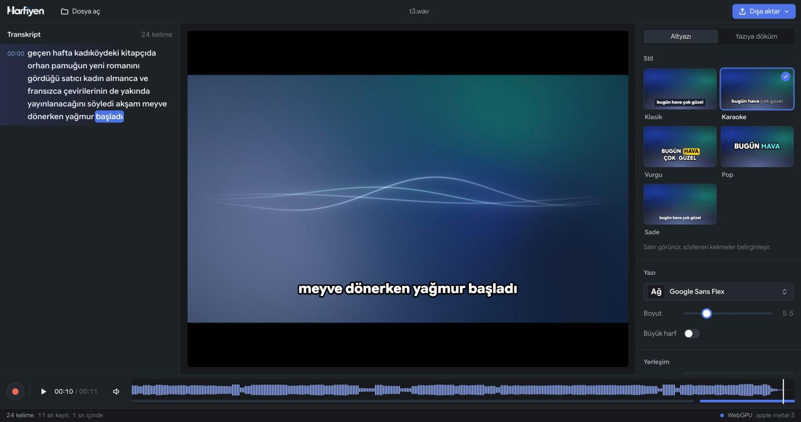

<p align="center">
  <picture>
    <source media="(prefers-color-scheme: dark)" srcset="public/brand/harfiyen-logo-light.png" />
    
  </picture>
</p>

<p align="center">
  <strong>Türkçe konuşmayı tarayıcıda yazıya döker, altyazıyı videonun içine yazar.</strong><br />
  Ses ve video bilgisayarından çıkmaz. 
</p>

<p align="center">
  Turkish speech-to-text and styled video captions, right in your browser.<br />
  Transcribe files or live audio, add punctuation, and export captioned videos — all processed locally.
</p>

<p align="center">
  <code>WebGPU</code> · <code>Türkçe</code> · <code>Lokal İşleme</code> · <code>Altyazı Stilleri</code> · <code>Canlı Mikrofon</code>
</p>

<p align="center">
  <a href="#hızlı-başlangıç">Hızlı başlangıç</a> ·
  <a href="#neler-yapabilir">Özellikler</a> ·
  <a href="#kullanım">Kullanım</a> ·
  <a href="#yapılacaklar">Yapılacaklar</a>
</p>

<p align="center">
  
</p>

---

Harfiyen, [seda-v0.1](https://huggingface.co/atasoglu/seda-v0.1) Türkçe konuşma tanıma modelini doğrudan
tarayıcıda, ekran kartı üzerinde (**WebGPU**) çalıştırır. Bir video ya da ses dosyası yüklersii, kelimeler
zaman kodlarıyla belirir, istediğin altyazı stilini seçersin ve altyazılı videoyu indirirsin. Mikrofonla
konuşurken de canlı çalışır.

## Neler yapabilir

### Yazıya döküm

- Video ve ses dosyaları: MP4, MOV, MKV, WebM, MP3, M4A, WAV, FLAC, OGG. Uzun dosyaları parça parça işler,
  bellek şişmez.
- Canlı mikrofon: kelimeler konuştuktan yaklaşık bir saniye sonra belirir, kayıt aynı anda saklanır.
- Üç doğruluk ayarı: **Hızlı**, **Dengeli** ve dil modeliyle **En doğru**.
- Otomatik noktalama ve büyük harf: döküm bitince nokta, virgül ve soru işareti eklenir; cümle başları
  ve özel adlar büyük harfle yazılır. Türkçe özel ad ekleri için kesme işareti eklenir ("İstanbul'da").
  Kelime zamanları korunur; işlem ⌘Z / Ctrl+Z ile geri alınabilir.
- Kelime düzeyinde zaman: bir kelimeye tıkla, kayıt o ana atlasın; çalarken konuşulan kelime vurgulanır.
- Düzenleme: satıra çift tıkla ve düzelt, satırı sil, ⌘Z ile geri al. Değişmeyen kelimelerin zamanları
  korunur.

### Altyazı

- Beş stil: **Klasik**, **Karaoke** (söylenen kelimeler belirginleşir), **Vurgu** (konuşulan kelime renkli
  kutuda), **Pop** (ortada iri, zıplayan kelimeler), **Sade**.
- Sekiz yazı tipi, hepsi Türkçe karakterlerin tamamıyla: Google Sans Flex, Montserrat, Poppins, Inter,
  Anton, Bebas Neue, Schibsted Grotesk, Literata.
- Boyut, konum, zemin (kutu, kontur, gölge), yazı ve vurgu rengi, Türkçe kurallarına uygun büyük harf
  (i → İ).

### Görüntü ve dışa aktarma

- WebGPU oynatıcı: önizlemede gördüğün, dışa aktarılan videonun birebir aynısıdır.
- Altyazılı MP4: kareler ekran kartında birleştirilir, video donanımla H.264 kodlanır, ses kopyalanır.
- Ses dosyaları ve kayıtlar için **aura**: sesle hareket eden yumuşak bir gradyan ve sakin bir ses
  görselleştirmesi. Bunlar da altyazılı 1080p MP4 olarak dışa aktarılabilir.
- SRT, WebVTT, düz metin, kelime zamanlı JSON ve panoya kopyalama.

> Konuşma tanıma modeli küçük harfli, noktalamasız metin üretir; noktalama ve büyük harf ayrı bir modelle
> sonradan eklenir. Sayılar yazıyla kalır ("bin dokuz yüz yirmi üç").

## Hızlı başlangıç

Gerekenler: Node.js 20+, Python 3.10+ (yalnızca modeli bir kez hazırlamak için) ve WebGPU destekli bir
tarayıcı (masaüstü Chrome veya Edge önerilir).

```bash
npm install
python3 -m pip install -r scripts/requirements.txt
npm run models     # konuşma tanıma ve noktalama modellerini indirir ve tarayıcı için dönüştürür (bir kez)
npm run dev        # http://localhost:5173
```

İlk açılışta tarayıcı yaklaşık 105 MB indirir (model ve ONNX Runtime) ve saklar; sonraki açılışlar
önbellekten, internetsiz çalışır. Noktalama ilk kullanıldığında ayrıca yaklaşık 60 MB indirilir ve
önbelleğe alınır. Ses ve metin işlenmek için sunucuya gönderilmez.

## Kullanım

| İşlem                      | Nasıl yapılır                                                                              |
| -------------------------- | ------------------------------------------------------------------------------------------ |
| Dosya açmak                | **Dosya aç** ya da dosyayı pencereye sürükle                                               |
| Mikrofonla kayıt           | Alttaki kırmızı düğme ya da **R**                                                          |
| Oynat / duraklat           | **Boşluk** ya da görüntüye tıkla                                                           |
| 5 sn geri / ileri          | **←** / **→**                                                                              |
| Tam ekran                  | **F** ya da görüntüye çift tıkla                                                           |
| Satırı düzenlemek          | Satıra çift tıkla, **Enter** kaydeder, **Esc** vazgeçer                                    |
| Geri al                    | **⌘Z** / **Ctrl+Z**                                                                        |
| Otomatik noktalama         | Sağ panelde **Noktalama ve büyük harf → Otomatik ekle** (varsayılan açık; tercih saklanır) |
| Noktalamayı elle uygulamak | Döküm bitince aynı bölümde **Şimdi uygula**                                                |
| Dışa aktarmak              | Sağ üstte **Dışa aktar**                                                                   |

## Performans

Apple Silicon (Metal), Chrome, dil modeliyle beam search:

| İşlem                   | Ölçüm                                                               |
| ----------------------- | ------------------------------------------------------------------- |
| Yazıya döküm            | gerçek zamanın ~12 katı (encoder ~38 ms / 0,64 sn'lik parça)        |
| Videoya altyazı yazma   | 640×360 videoda ~70 kare/sn; sesten 1080p video ~3 kat gerçek zaman |
| İlk açılış              | ~105 MB indirme, sonrası önbellekten                                |
| İlk noktalama kullanımı | ek ~60 MB indirme, sonrası önbellekten                              |

Ölçümler kısa test kayıtlarıyla yapıldı; uzun ve yüksek çözünürlüklü dosyalarda farklı olabilir.

Model kartındaki doğruluk değerleri (WER, düşük olan iyi):

| Test seti            | Hızlı | Dengeli | En doğru  |
| -------------------- | ----- | ------- | --------- |
| FLEURS-TR            | 15,14 | 14,24   | **11,52** |
| Common Voice 27.0 TR | 16,32 | 15,59   | **13,61** |
| ISSAI TSC            | 16,00 | 15,72   | **15,23** |

## Yayına alma

`npm run build` sonrası `dist/` herhangi bir statik sunucudan yayınlanabilir; model dosyaları `dist/models/`
altında uygulamayla birlikte gider. Sunucunun şu iki başlığı göndermesi gerekir (geliştirme sunucusu zaten
gönderiyor):

```http
Cross-Origin-Opener-Policy: same-origin
Cross-Origin-Embedder-Policy: require-corp
```

Uygulama bir web manifest'i ile gelir; Chrome ve Edge'de adres çubuğundan masaüstü uygulaması olarak
kurulabilir.

### Cloudflare Pages ve R2

Pages'te build komutu `npm run build`, çıktı klasörü `dist` olmalıdır. `public/_headers` gerekli başlıkları
derlemeye ekler. Pages'in dosya boyutu sınırı nedeniyle modeller ve büyük ONNX Runtime WASM dosyası R2'de
barındırılır. Build ortamına şu değişkenleri ekle (adresleri kendi R2 adresinle değiştir):

```text
VITE_MODELS_BASE_URL=https://YOUR-R2-PUBLIC-HOST/models
VITE_ORT_WASM_URL=https://YOUR-R2-PUBLIC-HOST/runtime/ort-wasm-simd-threaded.asyncify.wasm
```

R2'ye `public/models/` içeriğini `models/` altında, kullanılan ONNX Runtime sürümüne ait
`node_modules/onnxruntime-web/dist/ort-wasm-simd-threaded.asyncify.wasm` dosyasını `runtime/` altında yükle.
Bucket CORS ayarında uygulamanın `https://PROJE.pages.dev` adresinden `GET` ve `HEAD` isteklerine izin ver;
`AllowedHeaders` alanını `["*"]` olarak ayarla.

`VITE_ORT_WASM_URL` tanımlandığında büyük WASM dosyası Pages çıktısına eklenmez. Değişkenler tanımlanmazsa
yerel dosyalar kullanılır. GitHub'dan build alırken modeller zaten repo dışında kalır; yerel `dist/`
klasörünü elle yayınlıyorsan içindeki `models/` klasörünü Pages'e yükleme.

## Geliştirme

```bash
npm run typecheck  # TypeScript kontrolü
npm run build      # üretim derlemesi
npm run preview    # derlemeyi lokalinde önizle
```

## Bilinen sınırlar

- Altyazılı video şimdilik bellekte oluşturulup indiriliyor; çok uzun videolarda bellek yetmeyebilir.
- Döndürme bilgisi taşıyan dikey telefon videoları henüz denenmedi.
- Düzenleme metinle sınırlı; kelime zamanlarını elle kaydırmak yok.
- Ses dosyalarından üretilen MP4'te ses AAC ile kodlanır; tarayıcı AAC kodlayamıyorsa Opus kullanılır.
  Opus'lu MP4'ü QuickTime ve iPhone Fotoğraflar açmayabilir (Chrome, VLC ve sosyal platformlar açar).

## Yapılacaklar

Önerilen öncelik sırasıyla:

- [ ] **Projeyi kaydetme ve geri açma:** transkript ve düzeltmeler için otomatik yerel kayıt;
      projeyi dosya olarak indirip yeniden açma.
- [ ] **Kelime zamanlarını düzenleme:** başlangıç ve bitiş zamanlarını değiştirme;
      tüm altyazıya toplu zaman kaydırma.
- [ ] **Uzun video dışa aktarma:** büyük çıktıları belleği tüketmeden doğrudan diske yazma.
- [ ] **Dikey video ve uyumluluk kontrolleri:** telefon videolarının döndürme bilgisi,
      farklı çözünürlükler ve iPhone / QuickTime ses uyumluluğu.
- [ ] **Noktalama için Türkçe testleri:** özel ad ekleri, kısaltmalar, soru cümleleri ve uzun metinler;
      tekrar uygulama ve geri alma akışı.
- [ ] **Sayıları rakama çevirme seçeneği:** "bin dokuz yüz yirmi üç" → "1923";
      tarih, saat ve para ifadeleri için açılıp kapatılabilen dönüşüm.
- [ ] **Transkriptte bul ve değiştir:** yanlış tanınan bir kelimeyi veya ismi bütün kayıtta düzeltme.
- [ ] **SRT / VTT içe aktarma:** hazır altyazıyı açıp stillendirme ve videoya yazma.

---

## Lisanslar ve teşekkür

- Konuşma tanıma modeli [atasoglu/seda-v0.1](https://huggingface.co/atasoglu/seda-v0.1): Apache-2.0.
- Dil modeli dosyaları (`rnnlm`, `2gram`): CC BY-SA 4.0 (Türkçe Vikipedi üzerinde eğitildi).
- Algoritmalar [sherpa-onnx](https://github.com/k2-fsa/sherpa-onnx)'ten (Apache-2.0) uyarlandı.
- [ONNX Runtime Web](https://onnxruntime.ai) (MIT), [mediabunny](https://mediabunny.dev) (MPL-2.0),
  [React](https://react.dev) (MIT).
- Yazı tipleri: SIL Open Font License 1.1.
